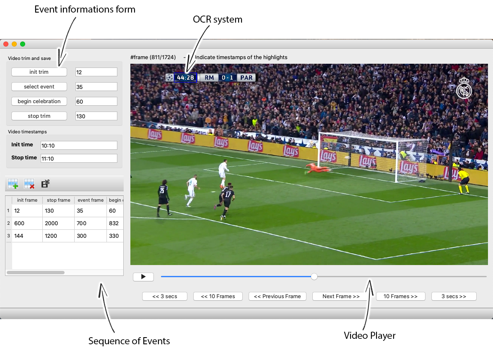

# video-labeler

## GUI

## Install

Install the necessary libraries

`pip install -r requirements.txt`

## Functionalities

Given a whole match video, this tool allows to: 
1) select the relevant events.
2) attach to them the match time using an OCR.
3) cut the selected events.
